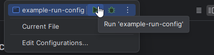

## Описание

Тестовое задание для поступления на курс SHIFT по Java.

ТЗ: TODO ссылчока

## Функционал и используемые технологии
  
Использовалась система сборки Maven  
Сборка была произведена JAVA liberica 21

Исходный класс Main находится по пути /src/main/java/org/shift/Main.java

Программа обрабатывает аргументы, поступившие в терминал (java -jar test.jar *args*) в любом порядке. Реализованы аргументы:  
- `-а` запись в уже имеющийся файл без удаления прошлых записей (без аргумента предыдущие записи будут удаляться)  
- `-f` вывод полной статистики в консоль, согласно заданию  
- `-s` вывод короткой статистики в консоль, согласно заданию  
- `-o` задание пути файла. Обрабатывается, как абсолютный путь, так и относительный. При вводе слова (н-р: "aaa123") в корневом каталоге будет создана соответствующая папка  
- `-p` задание префикса имени файла  

При отсутствии одного из типов данных, файл с этим типом данных не будет создаваться.  
При указании несуществующего имени файла или директории, директория и файл будут созданы.  
Обработка чисел с плавающей точкой реализована, как для экспоненциальной записи, так и для десятичных дробей.  
В случае ошибок программа выводит в консоль строку, содержащую информацию об ошибке. Программа не падает  

## Пример запуска

Можно посмотреть [тестовый класс](src/test/java/org/shift/MainTest.java).

1. По-умолчанию IDE (если вы используете IDEA) подключит конфигурацию из [файла](.run/example-run-config.run.xml) 
2. Вам нужно будет её выбрать и запустить 

